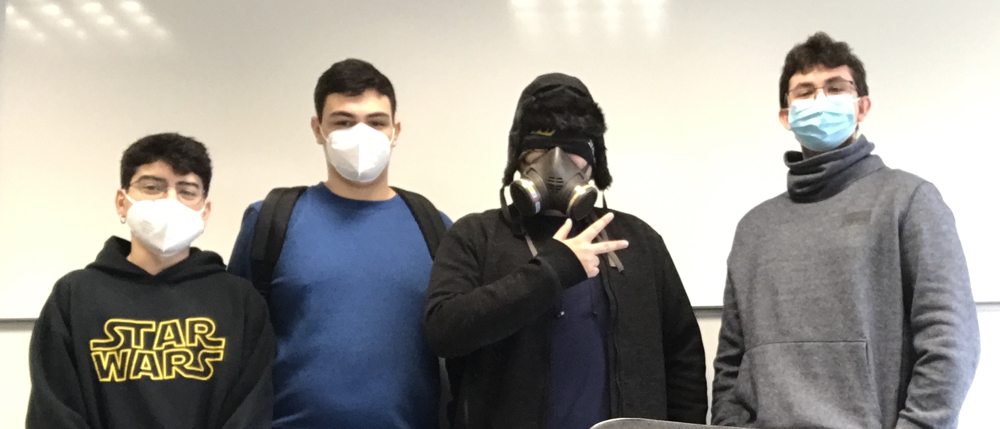

# FINAL PANDEMIC – PROJECT I: MERCS

## Welcome to Final Pandemic

Final Pandemic is a group of four students coursing the first year Bachelor's degree in Video Game Design and Development at UPC university. The integrants of the group are Alexandre Carreras, Pol Farreras, Brandon Arandia and Carlos Arnau.

GitHub project link: https://github.com/IconicGIT/FinalPandemic

&nbsp;

## TEAM MEMBERS

- Code: **Alexandre Carreras** [[ _TheGewehr_ ](https://github.com/TheGewehr)]:
  - Main Responsible of Final Pandemic's Mercs code.

- Art/Design: **Carlos Arnau** [[ _carlosarnau_ ](https://github.com/carlosarnau)]:
  - Main Responsible of Final Pandemic's Mercs art and design.

- Q&A: **Pol Farreras** [[ _fakefarreraspol_ ](https://github.com/fakefarreraspol)]:
  - Main Responsible of Final Pandemic's Mercs Performance and Well functioning.

- Management: **Brandon Arandia** [[ _IconicGIT_ ](https://github.com/IconicGIT)]:
  - Main Responsible of Final Pandemic's Mercs Team Management.

+ Even if the members are in charge of their labors, each team member will perform other member labors as a form of develop efficiency and mastery in different areas and abilities.

&nbsp;

## PROJECT I: MERCS

This game is inspired by the action movies of the 80’s, it is a Run and Gun game that was made by Capcom and was very appreciated by the arcade players. It contained a history and a local multiplayer, enemies, bosses, explosions, vehicles and more. 

&nbsp;

## GAME CONTROLS
~~~~~~~~~~~~~~~

Keyboard Player controls:
- UP: W key
- LEFT: A key
- RIGHT: D key
- DOWN: S key
- GUN SHOT: SPACE key

General controls:
- SKIP SCREEN: SPACE key
- EXIT GAME: ESC key
- WIN INSTANT: I key
- LOSE INSTANT: L key
- INTRODUCE COIN: SHIFT key

Gamepad:
- MOVE: JOYSTIC AND D-PAD
- SHOOT: K
- SKIP SCREEN: P
- BOMB: B
- START GAME: START
- EXIT GAME: BACK

~~~~~~~~~~~~~~~

&nbsp;

## ADDITIONAL COMMENTS

- Game still in development...
