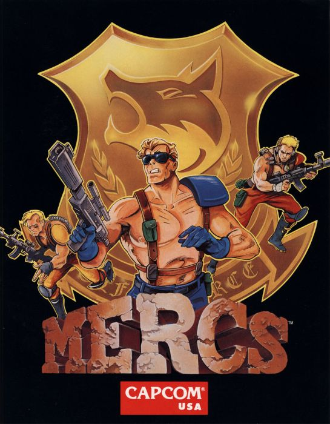

## Welcome to Final Pandemic

Final Pandemic is a group of four students coursing the first year Bachelor's degree in Video Game Design and Development at UPC university. The integrants of the group are Alexandre Carreras, Pol Farreras, Brandon Arandia and Carlos Arnau.

&nbsp;

### PROJECT I: MERCS

This game is inspired by the action movies of the 80’s, it is a Run and Gun game that was made by Capcom and was very appreciated by the arcade players. It contained a history and a local multiplayer, enemies, bosses, explosions, vehicles and more. 

&nbsp;

### GAMEPLAY

<iframe width="740" height="590" src="https://youtu.be/embed/fz9yPvX4ZoQ" frameborder="0" allowfullscreen></iframe>

&nbsp;

[Download the latest release](https://github.com/IconicGIT/FinalPandemic/releases/tag/1.0)

&nbsp;

### CONTROLS
~~~~~~~~~~~~~~~

Keyboard Player controls:
- UP --> W key
- LEFT --> A key
- RIGHT --> D key
- DOWN --> S key
- GUN SHOT --> SPACE key

General controls:
- SKIP SCREEN --> SPACE key
- EXIT GAME --> ESC key for 3 seconds
- INTRODUCE COIN --> SHIFT key

Debug Controls:
- GO DIRECT TO LEVEL --> Q key
- SPAWN ENEMY --> E key
- SPAWN BOSS --> B key
- SHOW COLLISIONS ON CAMERA --> F1 key
- FREE CAMREA CONTROL (ARROWS) --> F1 key
- HEAL PLAYER (by 1) --> H
- DAMAGE PLAYER (by 1) --> G
- WIN INSTANT --> I key
- LOSE INSTANT --> L key
- SCORE +1000 --> Z

Gamepad:
- MOVE --> Joystick AND D-PAD
- SHOOT --> K
- BOMB --> B
- SKIP SCREEN --> P
- START GAME --> Start
- EXIT GAME --> Back

~~~~~~~~~~~~~~~

&nbsp;

### TEAM MEMBERS

- Code: **Alexandre Carreras** [[ _TheGewehr_ ](https://github.com/TheGewehr)]:
  - Main Responsible of Final Pandemic's Mercs code.

- Art/Design: **Carlos Arnau** [[ _carlosarnau_ ](https://github.com/carlosarnau)]:
  - Main Responsible of Final Pandemic's Mercs art and design.

- Q&A: **Pol Farreras** [[ _fakefarreraspol_ ](https://github.com/fakefarreraspol)]:
  - Main Responsible of Final Pandemic's Mercs Performance and Well functioning.

- Management: **Brandon Arandia** [[ _IconicGIT_ ](https://github.com/IconicGIT)]:
  - Main Responsible of Final Pandemic's Mercs Team Management.

