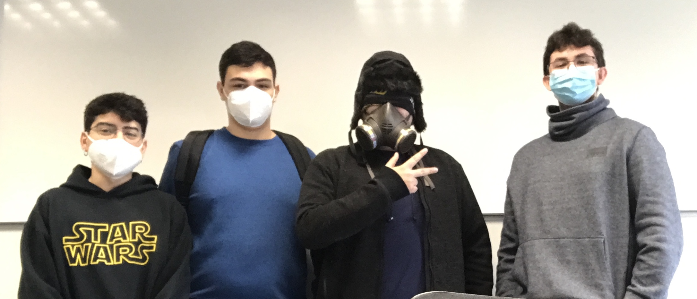

## Welcome to Final Pandemic

Final Pandemic is a group of four students coursing the first year Bachelor's degree in Video Game Design and Development at UPC university. The integrants of the group are Alexandre Carreras, Pol Farreras, Brandon Arandia and Carlos Arnau.

&nbsp;

### PROJECT I: MERCS

This game is inspired by the action movies of the 80’s, it is a Run and Gun game that was made by Capcom and was very appreciated by the arcade players. It contained a history and a local multiplayer, enemies, bosses, explosions, vehicles and more. 

&nbsp;

## Controls
~~~~~~~~~~~~~~~

Keyboard Player 1 controls:
- UP: W key
- LEFT / MOVE SELECTOR LEFT: A key
- RIGHT / MOVE SELECTOR RIGHT:: D key
- DOWN: S key
- BASIC SHOT: SPACE key
- SELECT CHARACTER: SPACE key 
- BOMB: B key

Keyboard Player 2 controls:
- UP: UP_ARROW key
- LEFT / MOVE SELECTOR LEFT: LEFT_ARROW key
- RIGHT / MOVE SELECTOR RIGHT:: RIGHT_ARROW key
- DOWN: DOWN_ARROW key
- BASIC SHOT: 1 key (NUMPAD)
- JOIN THE GAME: 2 key (NUMPAD)
- JOIN THE GAME (in-game): 1 key (NUMPAD)
- SELECT CHARACTER: 1 key (NUMPAD)
- BOMB: 2 key (NUMPAD)

General controls:
- SKIP SCREEN: SPACE key
- EXIT GAME: ESC key

Gamepad:

- MOVE: JOYSTIC AND D-PAD
- SHOOT AND SELECT CHARACTER: A 
- SKIP SCREEN: A
- BOMB: B
- START GAME: START
- EXIT GAME: BACK

~~~~~~~~~~~~~~~

&nbsp;

### Team Members

- Code: **Alexandre Carreras** [[ _TheGewehr_ ](https://github.com/TheGewehr)]:
  - Main Responsible of Final Pandemic's Mercs code.

- Art/Design: **Carlos Arnau** [[ _carlosarnau_ ](https://github.com/carlosarnau)]:
  - Main Responsible of Final Pandemic's Mercs art and design.

- Q&A: **Pol Farreras** [[ _fakefarreraspol_ ](https://github.com/fakefarreraspol)]:
  - Main Responsible of Final Pandemic's Mercs Performance and Well functioning.

- Management: **Brandon Arandia** [[ _IconicGIT_ ](https://github.com/IconicGIT)]:
  - Main Responsible of Final Pandemic's Mercs Team Management.

